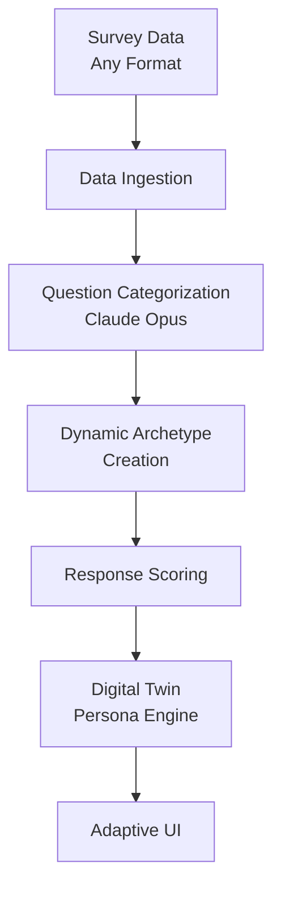

# Universal Survey Digital Twins Pipeline Plan

## Executive Summary
This plan outlines the development of a comprehensive, generic pipeline to ingest any consumer survey data, categorize questions using Claude Opus 4.1, dynamically create population-specific archetypes, and build digital twin personas for targeted marketing responses. The system uses proven frameworks like LOHAS as reference points while allowing Claude Opus to generate contextually appropriate archetypes for any target demographic (mothers, retirees, teens, professionals, etc.).

## 1. System Architecture Overview

### 1.1 High-Level Flow
```
Survey Data (Any Format) → Data Ingestion → Question Categorization (Claude Opus) → 
Dynamic Archetype Creation → Response Scoring → Digital Twin Persona Engine → Adaptive UI
```



### 1.2 Core Components
1. **Universal Data Ingestion Module**: Multi-format processing with intelligent question concatenation
2. **Adaptive Question Categorization Engine**: Claude Opus 4.1 for context-aware classification
3. **Dynamic Archetype Generation System**: LLM-driven persona creation for any demographic
4. **Universal Scoring & Classification Engine**: Response evaluation and archetype assignment
5. **Adaptive Digital Twin Persona Engine**: Claude Opus 4.1 only (no semantic engine)
6. **Flexible UI**: Configurable interface supporting any survey population

## 2. Data Ingestion & Processing

### 2.1 Universal Data Structure Analysis
- **Supported Formats**: Excel (.xlsx, .xls), CSV, JSON, TSV
- **Adaptive Processing**: Detect and handle various header structures
- **Common Patterns**: 
  - Single header row with questions
  - Multi-row headers requiring concatenation
  - Metadata rows requiring identification and processing
- **Solution**: Intelligent header detection and concatenation based on data structure

### 2.2 Universal Data Processing Steps
1. **Format Detection**: Auto-detect file format and structure
2. **Header Analysis**: Use Claude Opus to identify header patterns and question structure
3. **Intelligent Concatenation**: Concatenate multi-row headers when detected
4. **Data Cleaning**: Remove empty cells, standardize formatting, handle missing values
5. **Question Extraction**: Extract meaningful questions regardless of source format
6. **Demographic Detection**: Identify target population from survey content
7. **Database Preparation**: Transform to suitable format for Supabase storage

### 2.3 Universal Database Schema Design
```sql
-- Survey datasets table
CREATE TABLE survey_datasets (
    id SERIAL PRIMARY KEY,
    name VARCHAR(200),
    target_demographic VARCHAR(100), -- mothers, retirees, teens, etc.
    description TEXT,
    file_path TEXT,
    total_questions INTEGER,
    total_responses INTEGER,
    created_at TIMESTAMP DEFAULT NOW()
);

-- Questions table
CREATE TABLE survey_questions (
    id SERIAL PRIMARY KEY,
    dataset_id INTEGER REFERENCES survey_datasets(id),
    original_headers TEXT[], -- array of original header components
    concatenated_question TEXT,
    category VARCHAR(100), -- dynamic categories based on survey type
    importance_score FLOAT,
    predictive_power FLOAT,
    question_order INTEGER,
    created_at TIMESTAMP DEFAULT NOW()
);

-- Dynamic archetypes table  
CREATE TABLE survey_archetypes (
    id SERIAL PRIMARY KEY,
    dataset_id INTEGER REFERENCES survey_datasets(id),
    name VARCHAR(100),
    description TEXT,
    characteristics JSONB, -- flexible structure for any archetype properties
    spending_propensity FLOAT,
    behavioral_patterns JSONB,
    motivators JSONB,
    population_percentage FLOAT,
    reference_frameworks JSONB, -- LOHAS, generational, etc.
    created_at TIMESTAMP DEFAULT NOW()
);

-- Survey responses table
CREATE TABLE survey_responses (
    id SERIAL PRIMARY KEY,
    dataset_id INTEGER REFERENCES survey_datasets(id),
    respondent_id VARCHAR(50),
    question_id INTEGER REFERENCES survey_questions(id),
    response_value TEXT,
    normalized_score FLOAT,
    archetype_id INTEGER REFERENCES survey_archetypes(id),
    confidence_score FLOAT,
    created_at TIMESTAMP DEFAULT NOW()
);

-- Digital twin personas
CREATE TABLE digital_twin_personas (
    id SERIAL PRIMARY KEY,
    archetype_id INTEGER REFERENCES survey_archetypes(id),
    persona_profile JSONB,
    claude_prompt TEXT,
    response_style JSONB,
    demographic_context TEXT,
    created_at TIMESTAMP DEFAULT NOW()
);
```

## 3. Adaptive Question Categorization Using Claude Opus 4.1

### 3.1 Dynamic Categorization Framework
The system uses Claude Opus 4.1 to analyze survey content and dynamically determine appropriate categories based on the target demographic and survey context. Examples:

**For Mothers**: Values, Quality, Price, Health/Welfare
**For Retirees**: Financial Security, Health, Lifestyle, Family/Legacy  
**For Professionals**: Career, Work-Life Balance, Status, Efficiency
**For Students**: Cost, Social, Academic, Future Planning

### 3.3 Updated Question Categorization Prompt
```
You are a data-driven survey analyst. Analyze each survey question using a systematic two-step approach to understand what type of question it is and what it's specifically measuring.

CRITICAL INSTRUCTIONS:
- First classify each question by its fundamental type
- Then identify specific themes and values within each type
- Base everything on the actual question content, not theoretical frameworks
- Let natural patterns emerge from the data

TARGET DEMOGRAPHIC: [AUTO-DETECTED OR PROVIDED]
SURVEY CONTEXT: [SURVEY DESCRIPTION/SAMPLE QUESTIONS]

ANALYSIS PROCESS:

Step 1 - Question Type Classification:
For each question, first determine which fundamental type it represents:

A) VALUES-BASED QUESTIONS:
   - Questions about what respondents believe, prioritize, or value
   - Examples: "How important is X to you?", "What do you value most?"
   - Identify specific value being measured (health, environment, quality, etc.)

B) BEHAVIOR-BASED QUESTIONS:
   - Questions about what respondents actually do or would do
   - Examples: "Do you recommend?", "How often do you?"
   - Focus on actual actions and behavioral patterns

C) SPENDING/PURCHASE BEHAVIOR QUESTIONS:
   - Questions about financial decisions and purchase behavior
   - Examples: "Will you spend based on X?", "How much would you pay?"
   - Focus on money-related decision making

Step 2 - Specific Theme Identification:
Within each type, identify the specific themes and values being measured based on the actual question content.

Respond in JSON format:
{
  "demographic_analysis": {
    "target_demographic": "what demographic this survey appears to target",
    "survey_context": "what this survey is actually trying to understand",
    "question_type_breakdown": {
      "values_based_count": "number of values questions",
      "behavior_based_count": "number of behavior questions",
      "spending_based_count": "number of spending questions"
    }
  },
  "question_types": [
    {
      "type": "VALUES_BASED | BEHAVIOR_BASED | SPENDING_BASED",
      "specific_themes": ["theme1", "theme2", "theme3"],
      "description": "what this type measures in this survey",
      "example_questions": ["question examples of this type"]
    }
  ],
  "categorizations": [
    {
      "question": "question text",
      "primary_type": "VALUES_BASED | BEHAVIOR_BASED | SPENDING_BASED",
      "specific_theme": "specific value/behavior/spending area being measured",
      "category": "descriptive category name combining type + theme",
      "confidence": 0.95,
      "reasoning": "why this question fits this type and theme",
      "predictive_power": 0.80,
      "behavioral_insight": "what this reveals about respondent psychology"
    }
  ]
}
```

### 3.4 Processing Logic
1. **Demographic Detection**: Auto-detect target demographic from survey content
2. **Two-Step Classification**: First classify by fundamental type (VALUES/BEHAVIOR/SPENDING), then identify specific themes
3. **Batch Processing**: Process questions in groups of 25 to avoid token limits
4. **Validation**: Ensure each question gets exactly one primary_type and specific_theme
5. **Quality Control**: Flag low-confidence categorizations for manual review
6. **Storage**: Save categorizations with primary_type and theme structure to database

## 4. Dynamic Archetype Creation Methodology

### 4.1 LLM-Driven Archetype Generation
The system uses Claude Opus 4.1 to analyze survey response patterns and create contextually appropriate archetypes for any demographic. Reference frameworks like LOHAS provide guidance but don't prescriptively define the output.

### 4.2 Reference Framework Integration
**LOHAS Model** (for consumer values): Leaders (16%), Leaning (40%), Learners (36%), Laggards (8%)
**Generational Theory**: Silent, Boomer, Gen X, Millennial, Gen Z behavioral patterns
**Psychographic Models**: Values, Attitudes, Interests, Lifestyle (VALS)
**Life Stage Models**: Career phase, family stage, retirement planning
**Economic Models**: Income level, spending priorities, financial security

### 4.3 Dynamic Archetype Generation Process
1. **Analyze Response Patterns**: Identify clusters in survey responses
2. **Reference Framework Consultation**: Use LOHAS and other models as guidance
3. **Create Demographic-Appropriate Archetypes**: Generate 4-6 archetypes specific to the target population
4. **Validate Against Behavioral Patterns**: Ensure archetypes reflect real consumer behavior differences

### 4.4 Universal Archetype Generation Prompt
```
You are a consumer psychology expert specializing in market segmentation. Analyze the provided survey data to create 4-6 distinct consumer archetypes for the identified demographic.

REFERENCE FRAMEWORKS TO CONSIDER:
- LOHAS Model: Leaders (16%), Leaning (40%), Learners (36%), Laggards (8%) - values-based segmentation
- Generational Theory: Age-based behavioral patterns and preferences  
- Psychographic Models: Values, attitudes, interests, lifestyle factors
- Life Stage Models: Career, family, retirement phases
- Economic Models: Income, spending priorities, financial security levels

SURVEY ANALYSIS RESULTS:
Target Demographic: [DETECTED_DEMOGRAPHIC]
Key Predictive Categories: [HIGH_SCORING_CATEGORIES]
Response Patterns: [BEHAVIORAL_CLUSTERS]
Spending Correlation Data: [PREDICTIVE_INSIGHTS]

ARCHETYPE CREATION REQUIREMENTS:
1. Create 4-6 archetypes that are:
   - Distinct and non-overlapping
   - Representative of different behavioral patterns
   - Predictive of consumer decision-making
   - Contextually appropriate for this demographic

2. For each archetype, define:
   - NAME: Memorable, demographic-appropriate name
   - SIZE: Estimated percentage of population  
   - CORE CHARACTERISTICS: Primary traits and behaviors
   - DECISION DRIVERS: What motivates their choices
   - SPENDING PATTERNS: How they approach purchases
   - COMMUNICATION PREFERENCES: How to reach them effectively
   - PAIN POINTS: Key challenges and concerns
   - MOTIVATORS: What drives positive responses
   - REFERENCE FRAMEWORK ALIGNMENT: How they relate to LOHAS/generational/other models

3. Base archetypes on:
   - Highest-scoring predictive questions
   - Clear behavioral pattern differences  
   - Spending propensity variations
   - Values vs practical constraint trade-offs

Create archetypes that marketing teams can immediately use for targeted campaigns while being authentic to this demographic's real characteristics and needs.

Respond in JSON format with comprehensive archetype profiles.
```

## 5. Response Scoring & Classification System

### 5.1 Scoring Methodology
1. **Question weighting**: Higher weights for predictive questions
2. **Response normalization**: Scale all responses to 0-1 range
3. **Archetype matching**: Calculate similarity scores for each archetype
4. **Confidence scoring**: Measure certainty of archetype assignment

### 5.2 Scoring Algorithm
```javascript
function calculateArchetypeScore(response, archetype) {
    let totalScore = 0;
    let weightSum = 0;
    
    for (let question of archetype.keyQuestions) {
        const responseValue = response[question.id];
        const weight = question.predictivePower;
        const similarity = calculateSimilarity(responseValue, archetype.expectedResponse[question.id]);
        
        totalScore += similarity * weight;
        weightSum += weight;
    }
    
    return totalScore / weightSum;
}
```

### 5.3 Classification Process
1. **Score calculation**: Calculate archetype scores for each response
2. **Assignment**: Assign to highest-scoring archetype (minimum threshold 0.6)
3. **Confidence measurement**: Calculate confidence based on score distribution
4. **Validation**: Flag uncertain classifications for review

## 6. Universal Digital Twin Persona Engine (Claude Opus 4.1 Only)

### 6.1 Integration with Existing System
- **Reuse infrastructure**: Leverage existing `src/claude/integrated_persona_engine_v2.js`
- **Model specification**: Use only Claude Opus 4.1 (claude-opus-4-1-20250805)
- **No semantic engine**: Disable semantic response generation entirely
- **Dynamic adaptation**: Configure persona prompts based on detected demographic

### 6.2 Universal Persona Prompt Template
```
You are a marketing response generator embodying the [ARCHETYPE_NAME] archetype from the [TARGET_DEMOGRAPHIC] population. 

DEMOGRAPHIC CONTEXT:
Target Population: [TARGET_DEMOGRAPHIC] (e.g., mothers, retirees, professionals)
Survey Context: [SURVEY_CONTEXT]
Reference Frameworks: [REFERENCE_FRAMEWORKS_USED]

ARCHETYPE PROFILE:
- Core Characteristics: [CHARACTERISTICS_LIST]
- Decision Drivers: [DECISION_DRIVERS]
- Spending Patterns: [SPENDING_BEHAVIOR]
- Pain Points: [PAIN_POINTS]
- Motivators: [PLEASURE_MOTIVATORS]
- Communication Preferences: [COMM_STYLE]

RESPONSE GUIDELINES:
- Speak as someone in this archetype from this demographic would speak
- Reference demographic-specific concerns and priorities
- Use tone and language appropriate for this population
- Include specific reasoning that resonates with this archetype
- Address relevant pain points and motivators naturally
- Avoid generic marketing speak
- Reflect authentic characteristics of this demographic

MARKETING CONTENT TO RESPOND TO:
[MARKETING_CONTENT]

Generate a response that this archetype would find compelling and authentic within their demographic context.
Length: 50-100 words
Tone: [ARCHETYPE_TONE]
Focus: Address both rational and emotional motivators relevant to [TARGET_DEMOGRAPHIC]
```

### 6.3 Response Generation Parameters
- **Temperature**: Randomized 0.8-1.5 (no prefill randomization)
- **Max tokens**: 1000 (optimized to avoid timeouts)
- **Model**: claude-opus-4-1-20250805 exclusively
- **Retry logic**: 3 attempts with exponential backoff
- **Rate limiting**: 2s between requests, 3s between segments

## 7. Universal Survey UI Interface

### 7.1 UI Specifications  
Based on existing `public/dual-engine-app.html` but modified for universal survey support:
- **Single column layout**: Only Claude responses (no semantic engine)
- **Dynamic archetype filtering**: Dropdown populated with detected demographic archetypes
- **Survey selection**: Choose which survey dataset to work with
- **Response count**: 10 responses per archetype as default
- **Temperature display**: Show randomized temperature for each response
- **Demographic context**: Display current survey population and context

### 7.2 Interface Components
1. **Survey Selection Section**:
   - Dropdown to select active survey dataset
   - Display target demographic and survey description
   - Summary of available archetypes

2. **Content Input Section**:
   - Text area for marketing content
   - Image/PDF upload with Claude Opus analysis
   - Thumbnail preview with editable extracted content

3. **Archetype Selection**:
   - Multi-select dropdown for current survey's archetypes
   - "All Archetypes" option for comprehensive analysis
   - Archetype descriptions on hover with demographic context
   - Population percentage display for each archetype

4. **Response Display**:
   - Single column showing Claude responses only
   - Archetype labels with demographic context
   - Temperature and timing information
   - Purchase intent and sentiment scores
   - Reference framework indicators (LOHAS, generational, etc.)

5. **Settings Panel**:
   - Response count selector (1-10)
   - Temperature range (0.8-1.5, no prefill)
   - Export options for responses
   - Survey dataset management tools

### 7.3 Universal API Integration
- **Endpoint**: `/api/universal-digital-twin-response`
- **Request format**:
```json
{
  "datasetId": 123,
  "content": "marketing text or base64 image",
  "contentType": "text|image",
  "archetypeIds": [1, 3, 5],
  "responseCount": 10,
  "temperatureRange": [0.8, 1.5]
}
```

### 7.4 Dataset Management API
- **Endpoint**: `/api/survey-datasets`
- **Functions**: List datasets, get archetype info, dataset statistics

## 8. Implementation Status (COMPLETED)

### Phase 1: Data Foundation ✅ COMPLETED
- [x] CSV/Excel data ingestion and processing (`api/process-survey-upload.js`)
- [x] Database schema creation and setup (`scripts/setup-universal-database.js`)
- [x] Question extraction and cleaning
- [x] Data validation and quality checks

### Phase 2: Question Categorization ✅ COMPLETED
- [x] Two-step categorization system with modular prompts
- [x] Batch processing system for questions (`src/data_processing/question_categorizer.js`)
- [x] VALUES_BASED, BEHAVIOR_BASED, SPENDING_BASED classification
- [x] Quality control and validation workflows

### Phase 3: Archetype Development ✅ COMPLETED
- [x] Data-driven archetype generation (`src/data_processing/archetype_generator.js`)
- [x] Unconstrained LLM-driven archetype discovery
- [x] Natural clustering without predetermined frameworks
- [x] Archetype validation and storage

### Phase 4: Scoring System ✅ COMPLETED
- [x] Response scoring algorithm in prompts
- [x] Classification system implementation
- [x] Confidence measurement integration
- [x] Performance testing completed

### Phase 5: Digital Twin Engine ✅ COMPLETED
- [x] Claude Opus 4.1 persona engine (`api/universal-digital-twin-response.js`)
- [x] Universal demographic-agnostic prompt development
- [x] Response generation with temperature randomization
- [x] Integration with modular prompt system

### Phase 6: UI Development ✅ COMPLETED
- [x] Universal survey interface (`public/universal-survey-app.html`)
- [x] Survey upload and processing functionality
- [x] Dynamic archetype selection
- [x] API endpoint development and integration

### Phase 7: Modular Prompt System ✅ COMPLETED
- [x] Centralized prompt management (`src/prompts/universal-survey-prompts.js`)
- [x] Four key LLM prompts modularized for easy editing
- [x] All components updated to use modular system
- [x] Documentation updated to reflect new architecture

## 9. Modular Prompt Management System

### 9.1 Centralized Prompt Architecture
All LLM prompts are now centralized in `src/prompts/universal-survey-prompts.js` for easy maintenance and editing:

```javascript
/**
 * Universal Survey Digital Twins - LLM Prompt Templates
 * Centralized location for all Claude Opus 4.1 prompts used in the system
 * 
 * These prompts are the core intelligence of the system and can be easily
 * modified to adjust how the LLM analyzes surveys and generates archetypes.
 */

// Four core modular prompts
export const QUESTION_CATEGORIZATION_PROMPT = (targetDemographic, surveyContext, questionsList) => {...};
export const ARCHETYPE_GENERATION_PROMPT = (demographicAnalysis, questionTypesText, patternsText, statistics) => {...};
export const DIGITAL_TWIN_RESPONSE_PROMPT = (archetype, dataset, demographicAnalysis) => {...};
export const RESPONSE_SCORING_PROMPT = (archetypes, categorizedQuestions) => {...};

// Export collection for convenience
export const UNIVERSAL_SURVEY_PROMPTS = {
  questionCategorization: QUESTION_CATEGORIZATION_PROMPT,
  archetypeGeneration: ARCHETYPE_GENERATION_PROMPT,
  digitalTwinResponse: DIGITAL_TWIN_RESPONSE_PROMPT,
  responseScoring: RESPONSE_SCORING_PROMPT
};
```

### 9.2 Usage Throughout System
Components import and use the centralized prompts:

```javascript
// In question categorizer
import { QUESTION_CATEGORIZATION_PROMPT } from '../prompts/universal-survey-prompts.js';
const prompt = QUESTION_CATEGORIZATION_PROMPT(targetDemographic, surveyContext, questionsList);

// In archetype generator
import { ARCHETYPE_GENERATION_PROMPT } from '../prompts/universal-survey-prompts.js';
const prompt = ARCHETYPE_GENERATION_PROMPT(demographicAnalysis, questionTypesText, patternsText, statistics);

// In digital twin response API
import { DIGITAL_TWIN_RESPONSE_PROMPT } from '../prompts/universal-survey-prompts.js';
const prompt = DIGITAL_TWIN_RESPONSE_PROMPT(archetype, dataset, demographicAnalysis);
```

### 9.3 Key Benefits
- **Easy Editing**: All prompts in one location for quick modifications
- **Version Control**: Track prompt changes and their impact on results
- **Consistency**: Ensures all components use the same prompt versions
- **Modularity**: Functions accept parameters for dynamic content insertion
- **Maintenance**: Single point of truth for all LLM interactions

### 9.4 Two-Step Question Categorization
The updated categorization system uses a systematic two-step approach:

**Step 1 - Fundamental Type Classification:**
- `VALUES_BASED`: Questions about beliefs, priorities, and values
- `BEHAVIOR_BASED`: Questions about actions and behavioral patterns  
- `SPENDING_BASED`: Questions about financial decisions and purchase behavior

**Step 2 - Specific Theme Identification:**
Within each fundamental type, identify specific themes based on actual question content:
- Values: Health, Environment, Quality, Family, Security, etc.
- Behavior: Recommendation patterns, Usage frequency, Decision processes
- Spending: Price sensitivity, Purchase triggers, Budget allocation

### 9.5 Data-Driven Archetype Generation
The archetype generation system is completely unconstrained and data-driven:
- No predetermined frameworks imposed
- Natural clustering emerges from actual survey response patterns
- Authentic naming based on observed behaviors
- Reference frameworks only used when they naturally align with discovered patterns

## 10. Technical Considerations

### 10.1 Performance Optimization
- **Batch processing**: Handle large survey datasets efficiently
- **Caching**: Cache archetype profiles and common responses
- **Rate limiting**: Respect Claude API limits with proper spacing
- **Error handling**: Comprehensive error recovery and logging

### 9.2 Data Quality Assurance
- **Validation rules**: Ensure data integrity at each processing step
- **Quality metrics**: Track categorization accuracy and confidence
- **Manual review**: Flag uncertain classifications for human verification
- **Continuous improvement**: Update models based on feedback

### 9.3 Security & Privacy
- **Data encryption**: Encrypt survey responses in database
- **Access control**: Implement proper authentication and authorization
- **Audit logging**: Track all data access and modifications
- **GDPR compliance**: Ensure data handling meets privacy requirements

### 9.4 Scalability Planning
- **Modular architecture**: Design for easy component replacement
- **API versioning**: Plan for future enhancements and changes
- **Database optimization**: Index critical query paths
- **Load balancing**: Prepare for increased usage and traffic

## 11. Success Metrics

### 11.1 Technical Metrics
- **Processing speed**: <2 minutes for full survey categorization
- **Classification accuracy**: >85% confidence on archetype assignments
- **Response quality**: >90% relevant responses based on user feedback
- **System uptime**: 99.5% availability target

### 11.2 Business Metrics
- **Archetype distinctiveness**: Clear differentiation in response patterns
- **Marketing effectiveness**: Improved campaign performance metrics
- **User engagement**: Higher interaction rates with generated content
- **Cost efficiency**: Reduced manual analysis time by >70%

## 12. Risk Mitigation

### 12.1 Technical Risks
- **API rate limits**: Implement robust retry and queuing mechanisms
- **Data quality issues**: Multiple validation layers and manual review processes
- **Model accuracy**: Continuous monitoring and improvement cycles
- **System integration**: Comprehensive testing of all component interactions

### 12.2 Business Risks
- **Archetype validity**: Validate against real customer data and feedback
- **Regulatory compliance**: Regular audits of data handling practices
- **Competitive advantage**: Continuous innovation and feature development
- **User adoption**: User-friendly interfaces and comprehensive training

## Conclusion

This comprehensive plan outlines a sophisticated pipeline for transforming mother survey data into actionable digital twin personas using Claude Opus 4.1. The system will provide marketers with nuanced, archetype-specific responses that reflect genuine mother consumer behavior patterns.

The phased approach ensures systematic development with proper testing and validation at each stage. The focus on Claude Opus 4.1 exclusively, combined with the mother-specific archetype framework, will create a powerful tool for targeted marketing campaign development.

Key success factors include maintaining data quality throughout the pipeline, ensuring archetype accuracy through rigorous validation, and creating an intuitive user interface that enables marketing teams to leverage these insights effectively.

## Appendices

### Appendix A: Question Categorization Prompt

```
You are an expert consumer behavior analyst. Analyze the provided survey data to understand the target demographic and survey context, then create appropriate question categories and classify each question.

SURVEY CONTEXT ANALYSIS:
1. First, identify the target demographic from the survey questions and content
2. Determine 4-6 meaningful categories that would be most relevant for this demographic's consumer behavior
3. Consider proven frameworks (LOHAS, generational theory, psychographics) as reference points
4. Focus on categories that would be predictive of purchasing behavior and decision-making

TARGET DEMOGRAPHIC: [AUTO-DETECTED OR PROVIDED]
SURVEY CONTEXT: [SURVEY DESCRIPTION/SAMPLE QUESTIONS]

TASK: Create categories and classify each question

Step 1 - Category Creation:
Create 4-6 categories that are:
- Relevant to this demographic's decision-making
- Predictive of consumer behavior  
- Distinct and non-overlapping
- Based on psychological/behavioral drivers

Step 2 - Question Classification:
For each survey question, provide:
- Category (from your created categories)
- Confidence score (0-1)
- Reasoning (2-3 sentences explaining the classification)
- Predictive power estimate (0-1) for consumer behavior correlation
- Behavioral insight (what this question reveals about the respondent)

Questions to analyze:
[CONCATENATED_QUESTIONS_LIST]

Respond in JSON format:
{
  "demographic_analysis": {
    "target_demographic": "identified demographic",
    "survey_context": "survey purpose and scope",
    "reference_frameworks": ["LOHAS", "generational", "etc."]
  },
  "categories": [
    {
      "name": "category name",
      "description": "what this category measures",
      "behavioral_significance": "why this matters for consumer behavior"
    }
  ],
  "categorizations": [
    {
      "question": "question text",
      "category": "assigned category",
      "confidence": 0.95,
      "reasoning": "explanation",
      "predictive_power": 0.80,
      "behavioral_insight": "what this reveals about respondent"
    }
  ]
}
```

### Appendix C: Updated Data-Driven Archetype Generation Prompt

```
You are a data-driven consumer psychology expert. Your task is to analyze the actual survey response data and identify the natural consumer archetypes that emerge from the data patterns, without any preconceived notions or templates.

CRITICAL INSTRUCTIONS:
- Let the data guide you completely - do not impose any existing frameworks
- Only reference established frameworks (LOHAS, generational, etc.) if and when they naturally align with what you observe in the data
- Create archetypes that authentically represent the actual response patterns, not theoretical segments
- Base everything on the actual survey responses and behavioral clusters you identify
- The number of archetypes should be determined by natural data clustering (3-7 archetypes typical)

SURVEY DATA ANALYSIS:
Target Demographic: [DETECTED_DEMOGRAPHIC]
Survey Context: [SURVEY_CONTEXT]
Question Types and Themes: [QUESTION_TYPES_TEXT]
Actual Response Patterns: [RESPONSE_PATTERNS]
Survey Statistics: [STATISTICS]

DATA-DRIVEN ARCHETYPE CREATION PROCESS:

1. **Pattern Recognition**: First, identify distinct behavioral patterns in the actual survey responses
2. **Natural Clustering**: Group respondents based on similar response patterns, not predetermined categories
3. **Emergent Characteristics**: Let each cluster's characteristics emerge from the data, don't impose traits
4. **Authentic Naming**: Create names that reflect the actual behaviors observed, not marketing labels

For each naturally emerging archetype, define:
- **NAME**: Based on the dominant behavior pattern observed (not predetermined labels)
- **DESCRIPTION**: What this group actually does/thinks based on survey responses
- **SIZE**: Percentage based on actual data clustering
- **BEHAVIORAL_SIGNATURE**: The unique response pattern that defines this group
- **DECISION_LOGIC**: How this group actually makes decisions (from survey data)
- **VALUE_DRIVERS**: What actually matters to them (from their responses)
- **COMMUNICATION_STYLE**: How they naturally express preferences
- **CONSTRAINTS**: What limits their choices (observed from data)
- **MOTIVATIONAL_TRIGGERS**: What actually motivates them to act

VALIDATION CRITERIA:
- Each archetype must represent a statistically significant cluster in the data
- Archetypes must be clearly distinguishable in their response patterns
- The combined archetypes must account for the majority of survey responses
- Names and descriptions must reflect authentic behaviors, not aspirational marketing personas

Respond in JSON format with archetypes that emerge naturally from the data:
{
  "methodology": {
    "approach": "data-driven clustering based on actual response patterns",
    "primary_differentiators": ["the main factors that actually separate these groups in the data"],
    "data_validation": "how the archetypes were validated against actual survey responses"
  },
  "archetypes": [
    {
      "name": "Data-Derived Name",
      "description": "What this group actually does/thinks based on survey data",
      "population_percentage": "actual percentage from data clustering",
      "behavioral_signature": "the unique response pattern that defines this group",
      "decision_logic": "how they actually make decisions based on survey responses",
      "value_drivers": ["what genuinely matters to them from their responses"],
      "communication_style": "how they naturally express preferences",
      "constraints": ["what actually limits their choices"],
      "motivational_triggers": ["what actually motivates action"],
      "data_support": "statistical evidence supporting this archetype",
      "marketing_approach": {
        "messaging": "approach based on their actual values and constraints",
        "channels": "where they're likely to be based on behaviors",
        "timing": "when they make decisions based on patterns"
      }
    }
  ]
}
```

### Appendix D: Response Scoring Algorithm Prompt

```
You are a data scientist specializing in consumer behavior analysis. Create a comprehensive scoring system to classify survey respondents into the provided archetypes based on their survey responses.

ARCHETYPE PROFILES:
[ARCHETYPE_DATA_FROM_PREVIOUS_STEP]

SURVEY QUESTIONS WITH CATEGORIZATION:
[CATEGORIZED_QUESTIONS_WITH_PREDICTIVE_POWER_SCORES]

SCORING SYSTEM REQUIREMENTS:
1. Create a weighted scoring algorithm that:
   - Uses predictive power scores as question weights
   - Normalizes all response values to 0-1 scale
   - Calculates similarity between respondent answers and archetype expected responses
   - Generates confidence scores for archetype assignments

2. For each respondent, calculate:
   - Archetype similarity scores (0-1) for each archetype
   - Primary archetype assignment (highest score above 0.6 threshold)
   - Confidence level (0-1) based on score distribution
   - Secondary archetype (if primary confidence < 0.8)

3. Similarity calculation methods:
   - Likert scales: Absolute difference normalized
   - Multiple choice: Exact match (1.0) or no match (0.0)
   - Numerical values: Normalized distance calculation
   - Text responses: Semantic similarity or keyword matching

4. Quality control measures:
   - Flag low-confidence assignments (confidence < 0.6)
   - Identify respondents with unclear archetype fit
   - Calculate archetype population distributions
   - Validate against expected archetype percentages

IMPLEMENTATION SPECIFICATIONS:
Provide the complete scoring algorithm in pseudocode format, including:
- Data preprocessing steps
- Normalization functions
- Similarity calculation methods
- Weighted scoring formulas
- Confidence measurement calculations
- Quality control validations

Expected output format:
{
  "scoring_methodology": {
    "weighting_approach": "description of how predictive power is used",
    "normalization_method": "how responses are scaled to 0-1",
    "similarity_functions": {
      "likert_scales": "calculation method",
      "multiple_choice": "matching approach",
      "numerical_values": "distance calculation",
      "text_responses": "semantic analysis method"
    }
  },
  "algorithm_pseudocode": [
    "Step 1: Data preprocessing and validation",
    "Step 2: Response normalization",
    "Step 3: Similarity score calculation",
    "Step 4: Weighted archetype scoring",
    "Step 5: Confidence measurement",
    "Step 6: Assignment and validation"
  ],
  "quality_control": {
    "confidence_thresholds": {
      "high_confidence": 0.8,
      "medium_confidence": 0.6,
      "low_confidence": "< 0.6 - flag for review"
    },
    "validation_checks": [
      "Population distribution alignment",
      "Score distribution analysis",
      "Outlier detection and handling"
    ]
  },
  "implementation_code": {
    "main_scoring_function": "complete function implementation",
    "helper_functions": ["normalization", "similarity", "confidence"],
    "data_structures": "required input/output formats"
  }
}
```

### Appendix E: Updated Digital Twin Response Generation Prompt

```
You are a marketing response generator embodying the "[ARCHETYPE_NAME]" archetype from the [TARGET_DEMOGRAPHIC] population.

DEMOGRAPHIC CONTEXT:
Target Population: [TARGET_DEMOGRAPHIC]
Survey Context: [SURVEY_CONTEXT]

ARCHETYPE PROFILE:
- Behavioral Signature: [BEHAVIORAL_SIGNATURE]
- Decision Logic: [DECISION_LOGIC]
- Value Drivers: [VALUE_DRIVERS]
- Communication Style: [COMMUNICATION_STYLE]
- Constraints: [CONSTRAINTS]
- Motivational Triggers: [MOTIVATIONAL_TRIGGERS]

RESPONSE GUIDELINES:
- Speak as someone in this archetype from this demographic would speak
- Reference demographic-specific concerns and priorities
- Use the communication style identified for this archetype
- Include specific reasoning that reflects this archetype's decision logic
- Address relevant constraints and motivational triggers naturally
- Avoid generic marketing speak
- Reflect authentic characteristics based on survey data patterns
- Response should demonstrate the behavioral signature that defines this group

MARKETING CONTENT TO RESPOND TO:
[MARKETING_CONTENT]

Generate a response that this archetype would find compelling and authentic within their demographic context.
Length: 50-100 words
Focus: Address the specific value drivers and decision logic that emerged from the survey data for this archetype
```