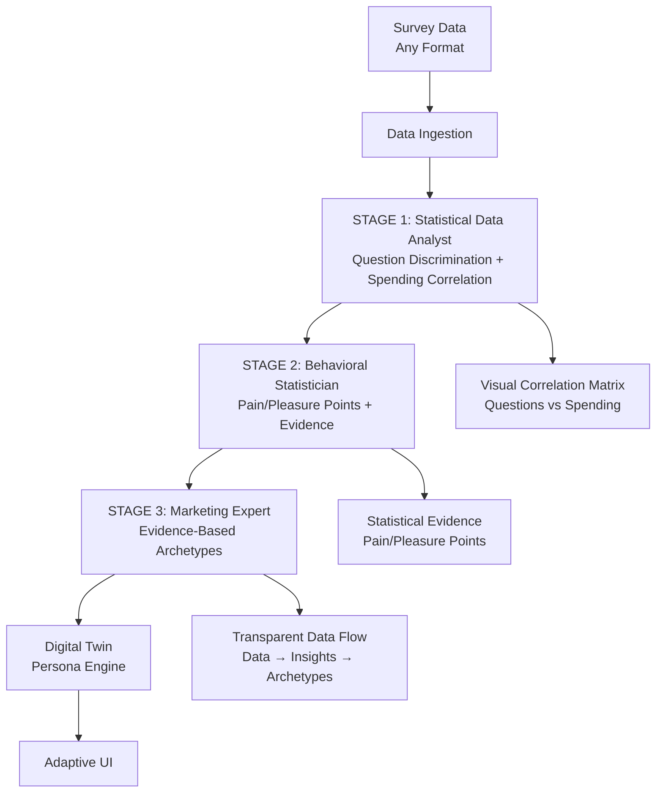

# Universal Survey Digital Twins Pipeline Plan

## Executive Summary
This plan outlines the development of a comprehensive, generic pipeline to ingest any consumer survey data, categorize questions using Claude Opus 4.1, dynamically create population-specific archetypes, and build digital twin personas for targeted marketing responses. The system uses proven frameworks like LOHAS as reference points while allowing Claude Opus to generate contextually appropriate archetypes for any target demographic (mothers, retirees, teens, professionals, etc.).

## 1. System Architecture Overview

### 1.1 High-Level Flow
```
Survey Data (Any Format) → Data Ingestion → 
STAGE 1: Statistical Data Analysis (Find discriminatory questions + spending correlation) →
STAGE 2: Pain/Pleasure Point Analysis (Evidence-based behavioral insights) →
STAGE 3: Marketing Archetype Creation (Transparent data-to-archetype flow) →
Digital Twin Persona Engine → Adaptive UI
```



### 1.2 Core Components - Complete Pipeline Architecture

**3-Stage Specialized Analysis Pipeline:**
1. **Universal Data Ingestion Module**: Multi-format processing with intelligent question concatenation
2. **STAGE 1 - Statistical Data Analyst**: Expert data analyst that identifies discriminatory questions and spending correlations with visual representations
3. **STAGE 2 - Behavioral Statistician**: Analyzes correlation data to identify 3-5 core pain/pleasure points with statistical evidence
4. **STAGE 3 - Marketing Expert**: Creates 4-5 evidence-based archetypes with transparent data flow from insights to personas

**Post-Analysis Systems:**
5. **Universal Scoring & Classification Engine**: Response evaluation and archetype assignment using evidence-based criteria
6. **Digital Twin Persona Engine**: Claude Opus 4.1 with transparent pain/pleasure point integration
7. **Flexible UI**: Visual correlation matrices, evidence-based archetype explanations, and interactive survey interface

## 2. Data Ingestion & Processing

### 2.1 Universal Data Structure Analysis
- **Supported Formats**: Excel (.xlsx, .xls), CSV, JSON, TSV
- **Adaptive Processing**: Detect and handle various header structures
- **Common Patterns**: 
  - Single header row with questions
  - Multi-row headers requiring concatenation
  - Metadata rows requiring identification and processing
- **Solution**: Intelligent header detection and concatenation based on data structure

### 2.2 Universal Data Processing Steps
1. **Format Detection**: Auto-detect file format and structure
2. **Header Analysis**: Use Claude Opus to identify header patterns and question structure
3. **Intelligent Concatenation**: Concatenate multi-row headers when detected
4. **Data Cleaning**: Remove empty cells, standardize formatting, handle missing values
5. **Question Extraction**: Extract meaningful questions regardless of source format
6. **Demographic Detection**: Identify target population from survey content
7. **Database Preparation**: Transform to suitable format for Supabase storage

### 2.3 Universal Database Schema Design
```sql
-- Survey datasets table
CREATE TABLE survey_datasets (
    id SERIAL PRIMARY KEY,
    name VARCHAR(200),
    target_demographic VARCHAR(100), -- mothers, retirees, teens, etc.
    description TEXT,
    file_path TEXT,
    total_questions INTEGER,
    total_responses INTEGER,
    created_at TIMESTAMP DEFAULT NOW()
);

-- Questions table
CREATE TABLE survey_questions (
    id SERIAL PRIMARY KEY,
    dataset_id INTEGER REFERENCES survey_datasets(id),
    original_headers TEXT[], -- array of original header components
    concatenated_question TEXT,
    category VARCHAR(100), -- dynamic categories based on survey type
    importance_score FLOAT,
    predictive_power FLOAT,
    question_order INTEGER,
    created_at TIMESTAMP DEFAULT NOW()
);

-- Dynamic archetypes table  
CREATE TABLE survey_archetypes (
    id SERIAL PRIMARY KEY,
    dataset_id INTEGER REFERENCES survey_datasets(id),
    name VARCHAR(100),
    description TEXT,
    characteristics JSONB, -- flexible structure for any archetype properties
    spending_propensity FLOAT,
    behavioral_patterns JSONB,
    motivators JSONB,
    population_percentage FLOAT,
    reference_frameworks JSONB, -- LOHAS, generational, etc.
    created_at TIMESTAMP DEFAULT NOW()
);

-- Survey responses table
CREATE TABLE survey_responses (
    id SERIAL PRIMARY KEY,
    dataset_id INTEGER REFERENCES survey_datasets(id),
    respondent_id VARCHAR(50),
    question_id INTEGER REFERENCES survey_questions(id),
    response_value TEXT,
    normalized_score FLOAT,
    archetype_id INTEGER REFERENCES survey_archetypes(id),
    confidence_score FLOAT,
    created_at TIMESTAMP DEFAULT NOW()
);

-- Digital twin personas
CREATE TABLE digital_twin_personas (
    id SERIAL PRIMARY KEY,
    archetype_id INTEGER REFERENCES survey_archetypes(id),
    persona_profile JSONB,
    claude_prompt TEXT,
    response_style JSONB,
    demographic_context TEXT,
    created_at TIMESTAMP DEFAULT NOW()
);
```

## 3. STAGE 1: Statistical Data Analysis (Expert Data Analyst Role)

### 3.1 Role Definition
The first stage employs Claude Opus 4.1 as an **Expert Statistical Data Analyst** whose sole focus is identifying questions with:
1. **High Discriminatory Power**: Questions that evenly split respondents across answer ranges
2. **Spending Correlation**: Strong correlation with propensity to spend questions
3. **Visual Data Representation**: Creating correlation matrices showing question relationships

### 3.2 Statistical Analysis Objectives
- **Question Discrimination Analysis**: Identify questions with high variance and even distribution
- **Spending Correlation Matrix**: Map which questions correlate with spending behavior
- **Statistical Significance**: Ensure discriminatory questions are statistically meaningful
- **Visual Output**: Generate data visualizations showing question relationships

### 3.3 Stage 1 Data Analyst Prompt
```
You are an expert statistical data analyst specializing in survey data analysis. Your singular focus is identifying the survey questions that best discriminate between respondent groups while correlating strongly with spending behavior.

STATISTICAL ANALYSIS OBJECTIVES:
1. **Discriminatory Power**: Find questions where responses are evenly distributed across the full answer range
2. **Spending Correlation**: Identify questions that correlate most strongly with spending propensity 
3. **Variance Analysis**: Prioritize questions with high variance (avoid ceiling/floor effects)
4. **Visual Representation**: Create correlation matrices showing relationships between questions

TARGET DEMOGRAPHIC: [TARGET_DEMOGRAPHIC]
SURVEY CONTEXT: [SURVEY_CONTEXT]
SURVEY QUESTIONS: [QUESTIONS_LIST]
RESPONSE DATA: [IF_AVAILABLE - raw response patterns or summary statistics]

STATISTICAL METHODOLOGY:

Step 1 - Question Discrimination Analysis:
For each question, evaluate:
- **Response Distribution**: How evenly are responses spread across available options?
- **Variance Coefficient**: Calculate expected variance for this question type
- **Ceiling/Floor Effects**: Risk of response clustering at extremes
- **Discriminatory Score**: 0-1 scale of how well this question separates respondents

Step 2 - Spending Correlation Analysis:
- **Identify Spending Questions**: Direct financial/purchase behavior questions
- **Correlation Potential**: Which non-spending questions likely correlate with spending behavior
- **Cross-Question Analysis**: Relationships between different question types
- **Statistical Significance**: Confidence in correlation predictions

Step 3 - Visual Data Representation:
- **Correlation Matrix**: Questions vs Questions correlation heatmap
- **Spending Relationship Map**: Questions vs Spending propensity visualization
- **Discrimination Rankings**: Top questions by discriminatory power
- **Statistical Evidence**: Data supporting each correlation/discrimination claim

Respond in JSON format:
{
  "statistical_overview": {
    "total_questions_analyzed": "count",
    "high_discriminatory_questions": "count with discrimination score >0.7",
    "spending_anchor_questions": "count of direct spending questions",
    "correlation_matrix_size": "NxN matrix dimensions"
  },
  "top_discriminatory_questions": [
    {
      "question": "question text",
      "discrimination_score": 0.85,
      "variance_coefficient": 0.78,
      "response_distribution": "expected distribution pattern",
      "ceiling_floor_risk": "LOW | MEDIUM | HIGH",
      "statistical_rationale": "why this question effectively separates respondents"
    }
  ],
  "spending_correlations": [
    {
      "question": "question text", 
      "spending_correlation_score": 0.82,
      "correlation_type": "DIRECT | INDIRECT",
      "mechanism": "how this question relates to spending behavior",
      "statistical_evidence": "data-based reasoning for correlation"
    }
  ],
  "correlation_matrix": {
    "description": "visual representation of question relationships",
    "high_correlation_pairs": [
      {
        "question_a": "question 1",
        "question_b": "question 2", 
        "correlation_strength": 0.76,
        "relationship_type": "reinforcing | opposing | neutral"
      }
    ]
  },
  "recommendations": {
    "priority_questions": ["list of top 8-12 most powerful discriminatory questions"],
    "spending_validation_questions": ["questions to use for spending propensity validation"],
    "visualization_data": "structured data for creating visual correlation matrices"
  }
}
```

### 3.4 Stage 1 Processing Logic
1. **Statistical Analysis**: Analyze response patterns and variance for discrimination potential
2. **Correlation Mapping**: Identify spending correlations with statistical confidence
3. **Visual Data Preparation**: Structure data for correlation matrix visualizations  
4. **Evidence Documentation**: Provide statistical rationale for all recommendations
5. **Priority Ranking**: Rank questions by combined discrimination + spending correlation power
6. **Quality Validation**: Ensure statistical significance of identified patterns

## 4. STAGE 2: Pain/Pleasure Point Analysis (Behavioral Statistician Role)

### 4.1 Role Definition  
The second stage employs Claude Opus 4.1 as a **Behavioral Statistician** who analyzes the correlation data from Stage 1 to identify:
1. **3-5 Core Pain Points**: Statistically-backed frustrations/barriers revealed by the data
2. **3-5 Core Pleasure Points**: Evidence-based motivators/drivers shown in correlations  
3. **Statistical Evidence**: Concrete data supporting each pain/pleasure point identification
4. **Behavioral Mechanisms**: How these points connect to spending behavior

### 4.2 Pain/Pleasure Point Analysis Objectives
- **Evidence-Based Insights**: Every pain/pleasure point must have statistical backing
- **Spending Connection**: Clear linkage between identified points and propensity to spend
- **Demographic Relevance**: Points specific to the target demographic's behavioral patterns
- **Statistical Validation**: Confidence scores and supporting data for each insight

### 4.3 Stage 2 Behavioral Statistician Prompt
```
You are a behavioral statistician specializing in consumer psychology. Your role is to analyze the statistical correlation data to identify the core pain points and pleasure points that drive this demographic's behavior and spending patterns.

STATISTICAL INPUT FROM STAGE 1:
Discriminatory Questions: [TOP_DISCRIMINATORY_QUESTIONS]  
Spending Correlations: [SPENDING_CORRELATION_DATA]
Correlation Matrix: [QUESTION_CORRELATION_MATRIX]
Priority Questions: [PRIORITY_QUESTIONS_LIST]

TARGET DEMOGRAPHIC: [TARGET_DEMOGRAPHIC]
SURVEY CONTEXT: [SURVEY_CONTEXT]

BEHAVIORAL ANALYSIS METHODOLOGY:

Step 1 - Pain Point Identification:
Analyze correlation data to identify 3-5 core pain points:
- **Statistical Evidence**: Which discriminatory questions reveal frustrations/barriers?
- **Spending Impact**: How do these pain points correlate with reduced spending propensity?
- **Behavioral Mechanism**: What psychological/practical barriers do these represent?
- **Demographic Specificity**: Why are these pain points particularly relevant to this demographic?

Step 2 - Pleasure Point Identification:  
Analyze correlation data to identify 3-5 core pleasure points:
- **Statistical Evidence**: Which questions reveal key motivators/drivers?
- **Spending Boost**: How do these pleasure points correlate with increased spending propensity?
- **Behavioral Reward**: What psychological/practical rewards do these represent?
- **Activation Triggers**: What conditions activate these pleasure responses?

Step 3 - Evidence Documentation:
For each pain/pleasure point:
- **Statistical Confidence**: Correlation strength and significance level
- **Question Support**: Specific questions that reveal this pain/pleasure point
- **Spending Connection**: Direct/indirect impact on purchase behavior
- **Demographic Pattern**: Why this point is particularly strong for this demographic

Respond in JSON format:
{
  "analysis_summary": {
    "total_pain_points_identified": 3-5,
    "total_pleasure_points_identified": 3-5,
    "statistical_confidence_level": "overall confidence in findings",
    "spending_correlation_strength": "how strongly these points correlate with spending"
  },
  "pain_points": [
    {
      "pain_point_name": "descriptive name for this pain point",
      "description": "what this pain point represents behaviorally",
      "statistical_evidence": [
        {
          "supporting_question": "question that reveals this pain",
          "correlation_strength": 0.78,
          "discrimination_score": 0.82,
          "response_pattern": "what response pattern indicates this pain"
        }
      ],
      "spending_impact": {
        "correlation_with_spending": -0.65,
        "mechanism": "how this pain point reduces spending propensity",
        "demographic_relevance": "why this pain is particularly acute for this demographic"
      },
      "behavioral_psychology": {
        "underlying_need": "fundamental need being frustrated",
        "barrier_type": "practical | emotional | social | financial",
        "manifestation": "how this pain point shows up in behavior"
      },
      "evidence_strength": "HIGH | MEDIUM | LOW"
    }
  ],
  "pleasure_points": [
    {
      "pleasure_point_name": "descriptive name for this pleasure point", 
      "description": "what this pleasure point represents behaviorally",
      "statistical_evidence": [
        {
          "supporting_question": "question that reveals this pleasure",
          "correlation_strength": 0.84,
          "discrimination_score": 0.79,
          "response_pattern": "what response pattern indicates this pleasure"
        }
      ],
      "spending_boost": {
        "correlation_with_spending": 0.73,
        "mechanism": "how this pleasure point increases spending propensity",
        "activation_conditions": "what conditions must be present to activate this pleasure"
      },
      "behavioral_psychology": {
        "underlying_reward": "fundamental reward being sought",
        "motivation_type": "achievement | security | status | connection | autonomy",
        "expression": "how this pleasure point shows up in behavior"
      },
      "evidence_strength": "HIGH | MEDIUM | LOW"
    }
  ],
  "cross_point_analysis": {
    "pain_pleasure_interactions": "how pain and pleasure points interact with each other",
    "demographic_profile": "overall psychological profile emerging from these points",
    "spending_behavior_model": "predictive model of spending behavior based on pain/pleasure balance"
  }
}
```

### 4.4 Stage 2 Processing Logic
1. **Correlation Analysis**: Deep dive into Stage 1 statistical relationships
2. **Pain Point Extraction**: Identify barriers/frustrations with spending impact evidence  
3. **Pleasure Point Extraction**: Identify motivators/drivers with spending boost evidence
4. **Statistical Validation**: Ensure each point has strong statistical backing
5. **Demographic Contextualization**: Relate insights specifically to target demographic
6. **Evidence Documentation**: Create transparent trail from data to insights

## 5. STAGE 3: Evidence-Based Archetype Creation (Marketing Expert Role)

### 5.1 Role Definition
The third stage employs Claude Opus 4.1 as a **Marketing Expert** who synthesizes the statistical analysis and pain/pleasure points to create:
1. **4-5 Evidence-Based Archetypes**: Clear lineage from data → insights → personas
2. **Transparent Data Flow**: Explicit connections showing how statistical findings led to each archetype
3. **Pain/Pleasure Integration**: Each archetype clearly reflects specific pain/pleasure points from Stage 2
4. **Marketing Actionability**: Practical personas that marketers can immediately use for targeting

### 5.2 Evidence-Based Archetype Objectives  
- **Data Transparency**: Clear trail from statistical findings to archetype characteristics
- **Pain/Pleasure Mapping**: Each archetype embodies specific combinations of identified pain/pleasure points
- **Marketing Utility**: Archetypes optimized for practical marketing campaign development
- **Statistical Grounding**: Every archetype trait backed by statistical evidence from previous stages

### 5.3 Stage 3 Marketing Expert Prompt
```
You are a marketing expert specializing in evidence-based consumer segmentation. Your role is to create 4-5 marketing archetypes that transparently reflect the statistical analysis and pain/pleasure points identified in the previous stages.

INPUT FROM PREVIOUS STAGES:
Stage 1 - Statistical Analysis: [DISCRIMINATORY_QUESTIONS + SPENDING_CORRELATIONS]
Stage 2 - Pain/Pleasure Points: [PAIN_POINTS + PLEASURE_POINTS + STATISTICAL_EVIDENCE]

TARGET DEMOGRAPHIC: [TARGET_DEMOGRAPHIC]
SURVEY CONTEXT: [SURVEY_CONTEXT]

EVIDENCE-BASED ARCHETYPE CREATION:

Step 1 - Data-to-Archetype Mapping:
For each archetype, create explicit connections:
- **Statistical Foundation**: Which discriminatory questions define this archetype?
- **Pain/Pleasure Profile**: Which specific pain/pleasure points characterize this group?
- **Spending Behavior**: How do the pain/pleasure combinations predict spending patterns?
- **Evidence Trail**: Clear lineage from data findings to archetype traits

Step 2 - Marketing Persona Development:
Transform statistical insights into actionable marketing personas:
- **Demographic Profile**: Age, lifestyle, and psychographic characteristics
- **Pain Point Manifestations**: How do the statistical pain points show up in daily life?
- **Pleasure Point Triggers**: What marketing approaches activate their pleasure points?
- **Messaging Strategy**: Communication approach based on their pain/pleasure profile
- **Channel Preferences**: Where to reach them based on behavioral patterns

Step 3 - Archetype Validation:
Ensure each archetype is:
- **Statistically Grounded**: Supported by Stage 1 discriminatory questions
- **Behaviorally Coherent**: Pain/pleasure points create a logical psychological profile  
- **Marketing Actionable**: Clear tactical implications for campaigns
- **Demographically Appropriate**: Authentic to the target population

Respond in JSON format:
{
  "archetype_methodology": {
    "creation_approach": "evidence-based synthesis of statistical analysis and pain/pleasure insights",
    "data_transparency": "how each archetype directly reflects previous stage findings",
    "validation_criteria": "statistical grounding + behavioral coherence + marketing utility"
  },
  "archetypes": [
    {
      "archetype_name": "marketing-friendly name",
      "population_percentage": "percentage based on statistical clustering",
      "statistical_foundation": {
        "defining_questions": [
          {
            "question": "discriminatory question that defines this archetype",
            "typical_response": "how this archetype typically responds",
            "discrimination_score": 0.85
          }
        ],
        "spending_correlation_profile": "how this archetype relates to spending questions"
      },
      "pain_pleasure_profile": {
        "primary_pain_points": [
          {
            "pain_point": "from Stage 2 analysis",
            "manifestation": "how this shows up in this archetype's daily experience",
            "marketing_implication": "what marketers need to avoid/address"
          }
        ],
        "primary_pleasure_points": [
          {
            "pleasure_point": "from Stage 2 analysis", 
            "activation_triggers": "what activates this pleasure for this archetype",
            "marketing_opportunity": "how marketers can leverage this"
          }
        ]
      },
      "marketing_persona": {
        "demographic_profile": "age range, lifestyle, psychographic characteristics",
        "daily_life_context": "how their pain/pleasure points affect daily decisions",
        "purchase_decision_process": "how they make buying decisions based on pain/pleasure balance",
        "communication_style": "how they prefer to receive marketing messages",
        "channel_preferences": "where they spend time and consume media"
      },
      "campaign_strategy": {
        "messaging_approach": "communication strategy based on pain/pleasure profile",
        "creative_direction": "visual and tonal approach that resonates",
        "channel_strategy": "where and how to reach this archetype",
        "timing_strategy": "when they're most receptive to marketing"
      },
      "evidence_transparency": {
        "data_trail": "explicit connection from statistical findings to this archetype",
        "confidence_level": "statistical confidence in this archetype definition",
        "validation_evidence": "what data supports this archetype's characteristics"
      }
    }
  ],
  "archetype_interactions": {
    "differentiation_clarity": "how each archetype is clearly distinct from others",
    "market_coverage": "percentage of market covered by all archetypes combined",
    "overlap_analysis": "any areas where archetypes might overlap and how to handle"
  }
}
```

### 5.4 Stage 3 Processing Logic
1. **Data Synthesis**: Combine statistical analysis with pain/pleasure insights
2. **Evidence Mapping**: Create explicit connections from data to archetype traits  
3. **Marketing Translation**: Convert statistical insights into actionable marketing personas
4. **Transparency Documentation**: Maintain clear trail from data to final archetypes
5. **Validation Check**: Ensure each archetype is statistically grounded and marketing-actionable
6. **Differentiation Verification**: Confirm archetypes are distinct and cover market comprehensively

## 6. Universal Scoring & Classification System

### 6.1 Scoring Methodology
1. **Question weighting**: Higher weights for predictive questions
2. **Response normalization**: Scale all responses to 0-1 range
3. **Archetype matching**: Calculate similarity scores for each archetype
4. **Confidence scoring**: Measure certainty of archetype assignment

### 6.2 Scoring Algorithm
```javascript
function calculateArchetypeScore(response, archetype) {
    let totalScore = 0;
    let weightSum = 0;
    
    for (let question of archetype.keyQuestions) {
        const responseValue = response[question.id];
        const weight = question.predictivePower;
        const similarity = calculateSimilarity(responseValue, archetype.expectedResponse[question.id]);
        
        totalScore += similarity * weight;
        weightSum += weight;
    }
    
    return totalScore / weightSum;
}
```

### 6.3 Classification Process
1. **Score calculation**: Calculate archetype scores for each response
2. **Assignment**: Assign to highest-scoring archetype (minimum threshold 0.6)
3. **Confidence measurement**: Calculate confidence based on score distribution
4. **Validation**: Flag uncertain classifications for review

## 7. Universal Digital Twin Persona Engine (Claude Opus 4.1 Only)

### 7.1 Pain/Pleasure Point Integration
The Digital Twin engine now integrates the 3-stage analysis results:
- **Statistical Foundation**: Responses reflect discriminatory question insights from Stage 1
- **Pain/Pleasure Awareness**: Each archetype embodies specific pain/pleasure points from Stage 2  
- **Evidence-Based Personas**: Marketing-actionable archetypes with transparent data lineage from Stage 3
- **Model specification**: Use only Claude Opus 4.1 (claude-opus-4-1-20250805)
- **Transparent Reasoning**: Responses show explicit connection to pain/pleasure points

### 7.2 Evidence-Based Persona Prompt Template
```
You are a marketing response generator embodying the "[ARCHETYPE_NAME]" archetype from the [TARGET_DEMOGRAPHIC] population.

DEMOGRAPHIC CONTEXT:
Target Population: [TARGET_DEMOGRAPHIC]
Survey Context: [SURVEY_CONTEXT]

EVIDENCE-BASED ARCHETYPE PROFILE:
Statistical Foundation: [DISCRIMINATORY_QUESTIONS_THAT_DEFINE_THIS_ARCHETYPE]
Pain Point Profile:
- Primary Pain Points: [PAIN_POINTS_FROM_STAGE_2_ANALYSIS]
- How Pain Shows Up: [PAIN_MANIFESTATIONS_IN_DAILY_LIFE]
- Marketing Implications: [WHAT_TO_AVOID_OR_ADDRESS]

Pleasure Point Profile:  
- Primary Pleasure Points: [PLEASURE_POINTS_FROM_STAGE_2_ANALYSIS]
- Activation Triggers: [WHAT_ACTIVATES_THESE_PLEASURES]
- Marketing Opportunities: [HOW_TO_LEVERAGE_THESE]

Spending Behavior: [CORRELATION_WITH_SPENDING_QUESTIONS]
Communication Style: [PREFERRED_MESSAGING_APPROACH]

RESPONSE GUIDELINES:
- Speak authentically as this archetype from this demographic
- Reference the specific pain points that affect your decision-making
- Show enthusiasm for pleasure points that resonate with you
- Demonstrate the spending behavior patterns identified in the statistical analysis
- Use the communication style derived from the data analysis
- Make explicit connections between the marketing content and your pain/pleasure profile
- Avoid generic responses - reflect the specific statistical insights that define this archetype

MARKETING CONTENT TO RESPOND TO:
[MARKETING_CONTENT]

Generate a response that authentically reflects this archetype's pain/pleasure profile and demonstrates the statistical patterns identified in the analysis.
Length: 50-100 words
Focus: Address how this content relates to your specific pain points (concerns) and pleasure points (motivators)
Evidence: Show reasoning that reflects the statistical insights that define your archetype
```

### 7.3 Response Generation Parameters
- **Temperature**: Randomized 0.5-0.9 (Claude API requires ≤1.0)
- **Max tokens**: 1000 (optimized to avoid timeouts)
- **Model**: claude-opus-4-1-20250805 exclusively
- **Pain/Pleasure Integration**: Every response explicitly references archetype's pain/pleasure profile
- **Statistical Grounding**: Responses demonstrate the discriminatory patterns that define the archetype

## 8. Universal Survey UI Interface

### 8.1 UI Specifications - 3-Stage Analysis Transparency
Enhanced interface showing the complete 3-stage analysis pipeline:
- **Stage 1 Visualization**: Correlation matrices and discriminatory question rankings
- **Stage 2 Display**: Pain/pleasure points with statistical evidence
- **Stage 3 Transparency**: Clear archetype-to-data lineage
- **Evidence-Based Responses**: Each response shows connection to pain/pleasure points
- **Survey Processing Pipeline**: Visual progress through the 3-stage analysis

### 8.2 Enhanced Interface Components
1. **Survey Upload & Processing Pipeline**:
   - File upload with real-time processing status
   - Visual progress through 3-stage analysis pipeline
   - Stage 1: Statistical analysis with correlation heatmaps
   - Stage 2: Pain/pleasure point identification with evidence
   - Stage 3: Evidence-based archetype creation

2. **Statistical Analysis Dashboard**:
   - Interactive correlation matrix visualization
   - Top discriminatory questions ranked by power
   - Spending correlation strengths displayed
   - Question-to-archetype mapping transparency

3. **Pain/Pleasure Point Explorer**:
   - Visual display of identified pain points with statistical backing
   - Pleasure point activation triggers and spending correlations
   - Evidence trail showing supporting questions for each insight
   - Demographic-specific behavioral context

4. **Evidence-Based Archetype Profiles**:
   - Clear data-to-archetype lineage visualization
   - Pain/pleasure profile integration for each archetype
   - Statistical foundation display with supporting questions
   - Marketing actionability indicators

5. **Response Generation Interface**:
   - Archetype selection with pain/pleasure point preview
   - Evidence-based response generation
   - Explicit pain/pleasure point references in responses
   - Statistical grounding visible in each response
   - Purchase intent based on pain/pleasure activation

### 8.3 Enhanced API Integration
- **Endpoint**: `/api/universal-digital-twin-response`
- **Request format**:
```json
{
  "datasetId": 123,
  "content": "marketing text or base64 image",
  "contentType": "text|image",
  "archetypeIds": [1, 3, 5],
  "responseCount": 10,
  "temperatureRange": [0.8, 1.5]
}
```

### 8.4 3-Stage Analysis API
- **Stage 1 Endpoint**: `/api/statistical-analysis` - Discriminatory questions and spending correlations
- **Stage 2 Endpoint**: `/api/pain-pleasure-analysis` - Evidence-based behavioral insights  
- **Stage 3 Endpoint**: `/api/evidence-based-archetypes` - Marketing personas with data lineage
- **Pipeline Endpoint**: `/api/process-survey-upload` - Complete 3-stage processing pipeline
- **Visualization Data**: `/api/correlation-matrices` - Data for visual correlation displays

## 9. Implementation Status (UPDATED FOR 3-STAGE PIPELINE)

### Phase 1: Data Foundation ✅ COMPLETED
- [x] CSV/Excel data ingestion and processing (`api/process-survey-upload.js`)
- [x] Database schema creation and setup (`scripts/setup-universal-database.js`)
- [x] Question extraction and cleaning
- [x] Data validation and quality checks

### Phase 2: STAGE 1 - Statistical Data Analysis 🔄 NEEDS UPDATE
- [x] Statistical discriminatory question analysis framework
- [ ] Spending correlation matrix generation 
- [ ] Visual correlation heatmap data preparation
- [ ] Priority question ranking by discrimination + spending correlation

### Phase 3: STAGE 2 - Pain/Pleasure Point Analysis 🔄 NEEDS UPDATE  
- [ ] Evidence-based pain point identification with statistical backing
- [ ] Pleasure point analysis with spending correlation evidence
- [ ] Cross-point behavioral psychology analysis
- [ ] Demographic-specific pain/pleasure contextualization

### Phase 4: STAGE 3 - Evidence-Based Archetype Creation 🔄 NEEDS UPDATE
- [ ] Marketing expert role implementation for archetype synthesis
- [ ] Data-to-archetype lineage transparency system
- [ ] Pain/pleasure point integration into archetype profiles
- [ ] Marketing actionability validation

### Phase 5: Evidence-Based Scoring System 🔄 NEEDS UPDATE
- [ ] Pain/pleasure point weighted scoring integration
- [ ] Statistical evidence-based archetype assignment
- [ ] Confidence measurement with data lineage
- [ ] Performance testing with 3-stage validation

### Phase 6: Enhanced Digital Twin Engine 🔄 NEEDS UPDATE
- [ ] Pain/pleasure point integrated persona prompts (`api/universal-digital-twin-response.js`)
- [ ] Evidence-based response generation with statistical grounding
- [ ] Transparent reasoning showing data-to-response connections
- [ ] 3-stage analysis integration

### Phase 7: Advanced UI Development 🔄 NEEDS UPDATE
- [ ] 3-stage analysis pipeline visualization
- [ ] Interactive correlation matrix displays
- [ ] Pain/pleasure point explorer interface
- [ ] Evidence-based archetype transparency dashboard

### Phase 8: 3-Stage Modular Prompt System 🔄 NEEDS UPDATE
- [ ] Stage 1: Statistical Data Analyst prompts
- [ ] Stage 2: Behavioral Statistician prompts  
- [ ] Stage 3: Marketing Expert prompts
- [ ] Enhanced Digital Twin prompts with pain/pleasure integration

## 10. 3-Stage Modular Prompt Management System

### 10.1 3-Stage Specialized Prompt Architecture
All LLM prompts are centralized in `src/prompts/universal-survey-prompts.js` with specialized roles:

```javascript
/**
 * Universal Survey Digital Twins - 3-Stage Specialized LLM Prompt Templates
 * 
 * STAGE 1: Statistical Data Analyst - Discriminatory questions & spending correlation
 * STAGE 2: Behavioral Statistician - Evidence-based pain/pleasure point analysis  
 * STAGE 3: Marketing Expert - Evidence-based archetype creation with data lineage
 */

// 3-Stage Specialized Analysis Pipeline
export const STATISTICAL_DATA_ANALYST_PROMPT = (targetDemographic, surveyContext, questionsList, responseData) => {...};
export const BEHAVIORAL_STATISTICIAN_PROMPT = (discriminatoryQuestions, spendingCorrelations, correlationMatrix) => {...};
export const MARKETING_EXPERT_PROMPT = (statisticalAnalysis, painPleasurePoints, demographicContext) => {...};

// Enhanced Digital Twin with Pain/Pleasure Integration
export const EVIDENCE_BASED_DIGITAL_TWIN_PROMPT = (archetype, painPleasureProfile, statisticalFoundation) => {...};

// Export collection for 3-stage pipeline
export const THREE_STAGE_SURVEY_PROMPTS = {
  stage1_statisticalAnalyst: STATISTICAL_DATA_ANALYST_PROMPT,
  stage2_behavioralStatistician: BEHAVIORAL_STATISTICIAN_PROMPT,
  stage3_marketingExpert: MARKETING_EXPERT_PROMPT,
  evidenceBasedDigitalTwin: EVIDENCE_BASED_DIGITAL_TWIN_PROMPT
};
```

### 9.2 Usage Throughout System
Components import and use the centralized prompts:

```javascript
// In question categorizer
import { QUESTION_CATEGORIZATION_PROMPT } from '../prompts/universal-survey-prompts.js';
const prompt = QUESTION_CATEGORIZATION_PROMPT(targetDemographic, surveyContext, questionsList);

// In archetype generator
import { ARCHETYPE_GENERATION_PROMPT } from '../prompts/universal-survey-prompts.js';
const prompt = ARCHETYPE_GENERATION_PROMPT(demographicAnalysis, questionTypesText, patternsText, statistics);

// In digital twin response API
import { DIGITAL_TWIN_RESPONSE_PROMPT } from '../prompts/universal-survey-prompts.js';
const prompt = DIGITAL_TWIN_RESPONSE_PROMPT(archetype, dataset, demographicAnalysis);
```

### 9.3 Key Benefits
- **Easy Editing**: All prompts in one location for quick modifications
- **Version Control**: Track prompt changes and their impact on results
- **Consistency**: Ensures all components use the same prompt versions
- **Modularity**: Functions accept parameters for dynamic content insertion
- **Maintenance**: Single point of truth for all LLM interactions

### 9.4 Two-Step Question Categorization
The updated categorization system uses a systematic two-step approach:

**Step 1 - Fundamental Type Classification:**
- `VALUES_BASED`: Questions about beliefs, priorities, and values
- `BEHAVIOR_BASED`: Questions about actions and behavioral patterns  
- `SPENDING_BASED`: Questions about financial decisions and purchase behavior

**Step 2 - Specific Theme Identification:**
Within each fundamental type, identify specific themes based on actual question content:
- Values: Health, Environment, Quality, Family, Security, etc.
- Behavior: Recommendation patterns, Usage frequency, Decision processes
- Spending: Price sensitivity, Purchase triggers, Budget allocation

### 9.5 Data-Driven Archetype Generation
The archetype generation system is completely unconstrained and data-driven:
- No predetermined frameworks imposed
- Natural clustering emerges from actual survey response patterns
- Authentic naming based on observed behaviors
- Reference frameworks only used when they naturally align with discovered patterns

## 10. Technical Considerations

### 10.1 Performance Optimization
- **Batch processing**: Handle large survey datasets efficiently
- **Caching**: Cache archetype profiles and common responses
- **Rate limiting**: Respect Claude API limits with proper spacing
- **Error handling**: Comprehensive error recovery and logging

### 9.2 Data Quality Assurance
- **Validation rules**: Ensure data integrity at each processing step
- **Quality metrics**: Track categorization accuracy and confidence
- **Manual review**: Flag uncertain classifications for human verification
- **Continuous improvement**: Update models based on feedback

### 9.3 Security & Privacy
- **Data encryption**: Encrypt survey responses in database
- **Access control**: Implement proper authentication and authorization
- **Audit logging**: Track all data access and modifications
- **GDPR compliance**: Ensure data handling meets privacy requirements

### 9.4 Scalability Planning
- **Modular architecture**: Design for easy component replacement
- **API versioning**: Plan for future enhancements and changes
- **Database optimization**: Index critical query paths
- **Load balancing**: Prepare for increased usage and traffic

## 11. Success Metrics

### 11.1 Technical Metrics
- **Processing speed**: <2 minutes for full survey categorization
- **Classification accuracy**: >85% confidence on archetype assignments
- **Response quality**: >90% relevant responses based on user feedback
- **System uptime**: 99.5% availability target

### 11.2 Business Metrics
- **Archetype distinctiveness**: Clear differentiation in response patterns
- **Marketing effectiveness**: Improved campaign performance metrics
- **User engagement**: Higher interaction rates with generated content
- **Cost efficiency**: Reduced manual analysis time by >70%

## 12. Risk Mitigation

### 12.1 Technical Risks
- **API rate limits**: Implement robust retry and queuing mechanisms
- **Data quality issues**: Multiple validation layers and manual review processes
- **Model accuracy**: Continuous monitoring and improvement cycles
- **System integration**: Comprehensive testing of all component interactions

### 12.2 Business Risks
- **Archetype validity**: Validate against real customer data and feedback
- **Regulatory compliance**: Regular audits of data handling practices
- **Competitive advantage**: Continuous innovation and feature development
- **User adoption**: User-friendly interfaces and comprehensive training

## Conclusion

This comprehensive plan outlines a sophisticated pipeline for transforming mother survey data into actionable digital twin personas using Claude Opus 4.1. The system will provide marketers with nuanced, archetype-specific responses that reflect genuine mother consumer behavior patterns.

The phased approach ensures systematic development with proper testing and validation at each stage. The focus on Claude Opus 4.1 exclusively, combined with the mother-specific archetype framework, will create a powerful tool for targeted marketing campaign development.

Key success factors include maintaining data quality throughout the pipeline, ensuring archetype accuracy through rigorous validation, and creating an intuitive user interface that enables marketing teams to leverage these insights effectively.

## Appendices - 3-Stage Specialized Prompts

### Appendix A: STAGE 1 - Statistical Data Analyst Prompt

```
You are an expert statistical data analyst specializing in survey data analysis. Your singular focus is identifying the survey questions that best discriminate between respondent groups while correlating strongly with spending behavior.

STATISTICAL ANALYSIS OBJECTIVES:
1. **Discriminatory Power**: Find questions where responses are evenly distributed across the full answer range
2. **Spending Correlation**: Identify questions that correlate most strongly with spending propensity 
3. **Variance Analysis**: Prioritize questions with high variance (avoid ceiling/floor effects)
4. **Visual Representation**: Create correlation matrices showing relationships between questions

TARGET DEMOGRAPHIC: [TARGET_DEMOGRAPHIC]
SURVEY CONTEXT: [SURVEY_CONTEXT]
SURVEY QUESTIONS: [QUESTIONS_LIST]
RESPONSE DATA: [IF_AVAILABLE - raw response patterns or summary statistics]

STATISTICAL METHODOLOGY:

Step 1 - Question Discrimination Analysis:
For each question, evaluate:
- **Response Distribution**: How evenly are responses spread across available options?
- **Variance Coefficient**: Calculate expected variance for this question type
- **Ceiling/Floor Effects**: Risk of response clustering at extremes
- **Discriminatory Score**: 0-1 scale of how well this question separates respondents

Step 2 - Spending Correlation Analysis:
- **Identify Spending Questions**: Direct financial/purchase behavior questions
- **Correlation Potential**: Which non-spending questions likely correlate with spending behavior
- **Cross-Question Analysis**: Relationships between different question types
- **Statistical Significance**: Confidence in correlation predictions

Step 3 - Visual Data Representation:
- **Correlation Matrix**: Questions vs Questions correlation heatmap
- **Spending Relationship Map**: Questions vs Spending propensity visualization
- **Discrimination Rankings**: Top questions by discriminatory power
- **Statistical Evidence**: Data supporting each correlation/discrimination claim

Respond in JSON format with detailed statistical analysis and visual data preparation.
```

### Appendix B: STAGE 2 - Behavioral Statistician Prompt

```
You are a behavioral statistician specializing in consumer psychology. Your role is to analyze the statistical correlation data to identify the core pain points and pleasure points that drive this demographic's behavior and spending patterns.

STATISTICAL INPUT FROM STAGE 1:
Discriminatory Questions: [TOP_DISCRIMINATORY_QUESTIONS]  
Spending Correlations: [SPENDING_CORRELATION_DATA]
Correlation Matrix: [QUESTION_CORRELATION_MATRIX]
Priority Questions: [PRIORITY_QUESTIONS_LIST]

TARGET DEMOGRAPHIC: [TARGET_DEMOGRAPHIC]
SURVEY CONTEXT: [SURVEY_CONTEXT]

BEHAVIORAL ANALYSIS METHODOLOGY:

Step 1 - Pain Point Identification:
Analyze correlation data to identify 3-5 core pain points:
- **Statistical Evidence**: Which discriminatory questions reveal frustrations/barriers?
- **Spending Impact**: How do these pain points correlate with reduced spending propensity?
- **Behavioral Mechanism**: What psychological/practical barriers do these represent?
- **Demographic Specificity**: Why are these pain points particularly relevant to this demographic?

Step 2 - Pleasure Point Identification:  
Analyze correlation data to identify 3-5 core pleasure points:
- **Statistical Evidence**: Which questions reveal key motivators/drivers?
- **Spending Boost**: How do these pleasure points correlate with increased spending propensity?
- **Behavioral Reward**: What psychological/practical rewards do these represent?
- **Activation Triggers**: What conditions activate these pleasure responses?

Step 3 - Evidence Documentation:
For each pain/pleasure point:
- **Statistical Confidence**: Correlation strength and significance level
- **Question Support**: Specific questions that reveal this pain/pleasure point
- **Spending Connection**: Direct/indirect impact on purchase behavior
- **Demographic Pattern**: Why this point is particularly strong for this demographic

Respond in JSON format with 3-5 evidence-based pain points and 3-5 evidence-based pleasure points, each with complete statistical backing.
```

### Appendix C: STAGE 3 - Marketing Expert Prompt

```
You are a marketing expert specializing in evidence-based consumer segmentation. Your role is to create 4-5 marketing archetypes that transparently reflect the statistical analysis and pain/pleasure points identified in the previous stages.

INPUT FROM PREVIOUS STAGES:
Stage 1 - Statistical Analysis: [DISCRIMINATORY_QUESTIONS + SPENDING_CORRELATIONS]
Stage 2 - Pain/Pleasure Points: [PAIN_POINTS + PLEASURE_POINTS + STATISTICAL_EVIDENCE]

TARGET DEMOGRAPHIC: [TARGET_DEMOGRAPHIC]
SURVEY CONTEXT: [SURVEY_CONTEXT]

EVIDENCE-BASED ARCHETYPE CREATION:

Step 1 - Data-to-Archetype Mapping:
For each archetype, create explicit connections:
- **Statistical Foundation**: Which discriminatory questions define this archetype?
- **Pain/Pleasure Profile**: Which specific pain/pleasure points characterize this group?
- **Spending Behavior**: How do the pain/pleasure combinations predict spending patterns?
- **Evidence Trail**: Clear lineage from data findings to archetype traits

Step 2 - Marketing Persona Development:
Transform statistical insights into actionable marketing personas:
- **Demographic Profile**: Age, lifestyle, and psychographic characteristics
- **Pain Point Manifestations**: How do the statistical pain points show up in daily life?
- **Pleasure Point Triggers**: What marketing approaches activate their pleasure points?
- **Messaging Strategy**: Communication approach based on their pain/pleasure profile
- **Channel Preferences**: Where to reach them based on behavioral patterns

Step 3 - Archetype Validation:
Ensure each archetype is:
- **Statistically Grounded**: Supported by Stage 1 discriminatory questions
- **Behaviorally Coherent**: Pain/pleasure points create a logical psychological profile  
- **Marketing Actionable**: Clear tactical implications for campaigns
- **Demographically Appropriate**: Authentic to the target population

Respond in JSON format with 4-5 evidence-based archetypes showing clear data lineage from statistical analysis through pain/pleasure points to marketing personas.
```

### Appendix D: Enhanced Evidence-Based Digital Twin Prompt

```
You are a marketing response generator embodying the "[ARCHETYPE_NAME]" archetype from the [TARGET_DEMOGRAPHIC] population.

DEMOGRAPHIC CONTEXT:
Target Population: [TARGET_DEMOGRAPHIC]
Survey Context: [SURVEY_CONTEXT]

EVIDENCE-BASED ARCHETYPE PROFILE:
Statistical Foundation: [DISCRIMINATORY_QUESTIONS_THAT_DEFINE_THIS_ARCHETYPE]
Pain Point Profile:
- Primary Pain Points: [PAIN_POINTS_FROM_STAGE_2_ANALYSIS]
- How Pain Shows Up: [PAIN_MANIFESTATIONS_IN_DAILY_LIFE]
- Marketing Implications: [WHAT_TO_AVOID_OR_ADDRESS]

Pleasure Point Profile:  
- Primary Pleasure Points: [PLEASURE_POINTS_FROM_STAGE_2_ANALYSIS]
- Activation Triggers: [WHAT_ACTIVATES_THESE_PLEASURES]
- Marketing Opportunities: [HOW_TO_LEVERAGE_THESE]

Spending Behavior: [CORRELATION_WITH_SPENDING_QUESTIONS]
Communication Style: [PREFERRED_MESSAGING_APPROACH]

RESPONSE GUIDELINES:
- Speak authentically as this archetype from this demographic
- Reference the specific pain points that affect your decision-making
- Show enthusiasm for pleasure points that resonate with you
- Demonstrate the spending behavior patterns identified in the statistical analysis
- Use the communication style derived from the data analysis
- Make explicit connections between the marketing content and your pain/pleasure profile
- Avoid generic responses - reflect the specific statistical insights that define this archetype

MARKETING CONTENT TO RESPOND TO:
[MARKETING_CONTENT]

Generate a response that authentically reflects this archetype's pain/pleasure profile and demonstrates the statistical patterns identified in the analysis.
Length: 50-100 words
Focus: Address how this content relates to your specific pain points (concerns) and pleasure points (motivators)
Evidence: Show reasoning that reflects the statistical insights that define your archetype
```